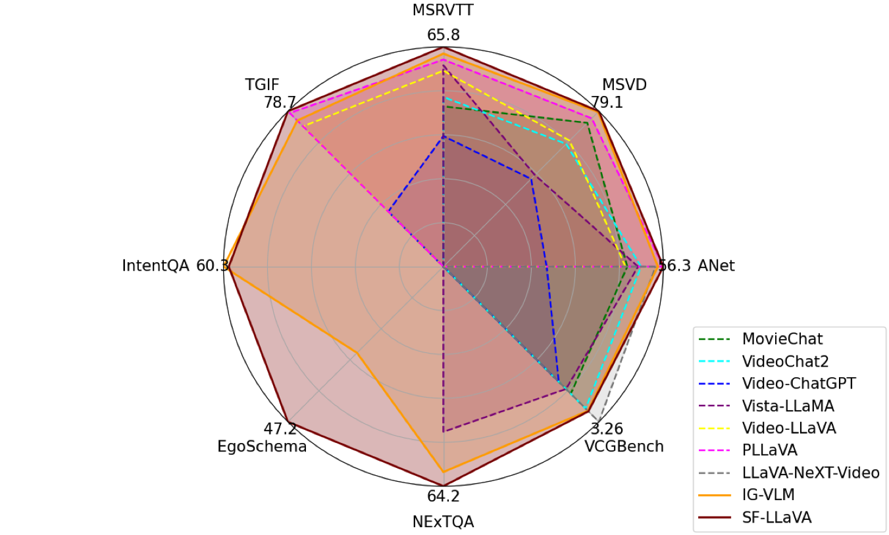

# SlowFast-LLaVA: A Strong Training-Free Baseline for Video Large Language Models

This project accompanies the research paper,

[SlowFast-LLaVA: A Strong Training-Free Baseline for Video Large Language Models](https://arxiv.org/abs/2407.15841) <br>
*[Mingze Xu](https://xumingze0308.github.io)\*, [Mingfei Gao](https://fly6464.github.io)\*, [Zhe Gan](https://zhegan27.github.io), [Hong-You Chen](https://sites.google.com/view/hongyouc), [Zhengfeng Lai](https://zjujefflai.github.io), [Haiming Gang](https://haiminggang.com), [Kai Kang](http://kangk.ai), [Afshin Dehghan](https://www.afshindehghan.com/)*

<p align="center">
    
</p>

SlowFast-LLaVA is a training-free multimodal large language model (LLM) for video understanding and reasoning. Without requiring fine-tuning on any data, it achieves comparable or even better performance compared to state-of-the-art Video LLMs on a wide range of VideoQA tasks and benchmarks, as shown in the figure.

## Table of contents
- [Getting Started](#getting-started)
    - [Installation](#installation)
    - [Data Preparation](#data-preparation)
- [Configuration](#configuration)
- [Inference and Evaluation](#inference-and-evaluation)
    - [Output Structures](#output-structures)
- [Demo](#demo)
- [License](#license)
- [Citations](#citations)

## Getting Started

### Installation

- The code is developed with CUDA 11.7, ***Python >= 3.10.12***, ***PyTorch >= 2.1.0***

    0. [Optional but recommended] Create a new conda environment.
        ```
        conda create -n sf_llava python=3.10.12
        ```
        And activate the environment.
        ```
        conda activate sf_llava
        ```

    1. Install the requirements.
        ```
        bash setup_env.sh
        ```

    2. Add OpenAI key and organization to the system environment to use GPT-3.5-turbo for model evaluation.
        ```
        export OPENAI_API_KEY=$YOUR_OPENAI_API_KEY
        export OPENAI_ORG=$YOUR_OPENAI_ORG  # optional
        ```

    3. Download pre-trained LLaVA-NeXT weights from [`HuggingFace`](https://huggingface.co/collections/liuhaotian/llava-16-65b9e40155f60fd046a5ccf2), and put them under the [`ml-slowfast-llava`](./) folder.
        ```
        git lfs clone https://huggingface.co/liuhaotian/llava-v1.6-vicuna-7b liuhaotian/llava-v1.6-vicuna-7b
        git lfs clone https://huggingface.co/liuhaotian/llava-v1.6-34b liuhaotian/llava-v1.6-34b
        ```

### Data Preparation

1. We prepare the ground-truth question and answer files based on [`IG-VLM`](https://github.com/imagegridworth/IG-VLM/tree/main), and put them under [playground/gt_qa_files](playground/gt_qa_files).

    - MSVD-QA
        - Download the `MSVD_QA.csv` from the [`here`](https://github.com/imagegridworth/IG-VLM/blob/main/data/open_ended_qa/MSVD_QA.csv)
        - Reformat the files by running
            ```
            python scripts/data/prepare_msvd_qa_file.py --qa_file $PATH_TO_CSV_FILE
            ```
    - MSRVTT-QA
        - Download the `MSRVTT_QA.csv` from the [`here`](https://github.com/imagegridworth/IG-VLM/blob/main/data/open_ended_qa/MSRVTT_QA.csv)
        - Reformat the files by running
            ```
            python scripts/data/prepare_msrvtt_qa_file.py --qa_file $PATH_TO_CSV_FILE
            ```
    - TGIF-QA
        - Download the `TGIF_FrameQA.csv` from the [`here`](https://github.com/imagegridworth/IG-VLM/blob/main/data/open_ended_qa/TGIF_FrameQA.csv)
        - Reformat the files by running
            ```
            python scripts/data/prepare_tgif_qa_file.py --qa_file $PATH_TO_CSV_FILE
            ```
    - Activitynet-QA
        - Download the `Activitynet_QA.csv` from the [`here`](https://github.com/imagegridworth/IG-VLM/blob/main/data/open_ended_qa/ActivityNet_QA.csv)
        - Reformat the files by running
            ```
            python scripts/data/prepare_activitynet_qa_file.py --qa_file $PATH_TO_CSV_FILE
            ```
    - NExT-QA
        - Download the `NExT_QA.csv` from the [`here`](https://github.com/imagegridworth/IG-VLM/blob/main/data/multiple_choice_qa/NExT_QA.csv)
        - Reformat the files by running
            ```
            python scripts/data/prepare_nextqa_qa_file.py --qa_file $PATH_TO_CSV_FILE
            ```
    - EgoSchema
        - Download the `EgoSchema.csv` from the [`here`](https://github.com/imagegridworth/IG-VLM/blob/main/data/multiple_choice_qa/EgoSchema.csv)
        - Reformat the files by running
            ```
            python scripts/data/prepare_egoschema_qa_file.py --qa_file $PATH_TO_CSV_FILE
            ```
    - IntentQA
        - Download the `IntentQA.csv` from the [`here`](https://github.com/imagegridworth/IG-VLM/blob/main/data/multiple_choice_qa/IntentQA.csv)
        - Reformat the files by running
            ```
            python scripts/data/prepare_intentqa_qa_file.py --qa_file $PATH_TO_CSV_FILE
            ```
    - VCGBench
        - Download all files under [`text_generation_benchmark`](https://github.com/imagegridworth/IG-VLM/blob/main/data/text_generation_benchmark)
        - Reformat the files by running
            ```
            python scripts/data/prepare_vcgbench_qa_file.py --qa_folder $TEXT_GENERATION_BENCHMARK
            ```
    

2. Download the raw videos from the official websites.

    - Openset VideoQA

        - [Recomanded] Option 1: Follow the instruction in [`Video-LLaVA`](https://github.com/PKU-YuanGroup/Video-LLaVA/blob/main/TRAIN_AND_VALIDATE.md) to download raw videos.
        - Option 2: Download videos from the data owners.
            - [`MSVD-QA`](https://github.com/xudejing/video-question-answering?tab=readme-ov-file)
            - [`MSRVTT-QA`](https://github.com/xudejing/video-question-answering?tab=readme-ov-file)
            - [`TGIF-QA`](https://github.com/YunseokJANG/tgif-qa?tab=readme-ov-file)
            - [`ActivityNet-QA`](https://github.com/MILVLG/activitynet-qa)

    - Multiple Choice VideoQA

        - Download datasets from the data owners.
            - [`NExT-QA`](https://github.com/doc-doc/NExT-QA)
            - [`EgoSchema`](https://egoschema.github.io)
            - [`IntentQA`](https://github.com/JoseponLee/IntentQA)

    - Text Generation

        - The videos are based on ActivityNet, and you can reuse the one from Openset VideoQA.

3. Organize the raw videos under [playground/data](playground/data).

    - To directly use our data loaders without changing paths, please organize your datasets as follows

        ```
        $ ml-slowfast-llava/playground/data
            ├── video_qa
                ├── MSVD_Zero_Shot_QA
                    ├── videos
                        ├── ...
                ├── MSRVTT_Zero_Shot_QA
                    ├── videos
                        ├── all
                            ├── ...
                ├── TGIF_Zero_Shot_QA
                   ├── mp4
                       ├── ...
                ├── Activitynet_Zero_Shot_QA
                   ├── all_test
                       ├── ...
            ├── multiple_choice_qa
                ├── NExTQA
                    ├── video
                       ├── ...
                ├── EgoSchema
                    ├── video
                       ├── ...
                ├── IntentQA
                    ├── video
                       ├── ...
        ```

## Configuration

We use yaml config to control the design choice of SlowFast-LLaVA. We will use the config of [SlowFast-LLaVA-7B](cfgs/slowfast_llava_7b-resize-slow_10frms_spatial_1d_max_pool_fast_4x4-50_frms.yaml) as an example to explain some important parameters.

- `SCRIPT`: It controls the tasks that you want to run.
- `DATA_DIR` and `CONV_MODE`: They are the data directories and prompts for different tasks. They could be either a string or a list of strings, but must match the `SCRIPT`.
- `NUM_FRAMES`: The total number of sampled video frames.
- `TEMPORAL_AGGREGATION`: It controls the setting of Slow and Fast pathways. It should be a string with the pattern `slowfast-slow_{$S_FRMS}frms_{$S_POOL}-fast_{$F_OH}x{F_OW}`, where
    - `$S_FRMS` should be an integer which indicates the number of frames in the Slow pathway,
    - `$S_POOL` should be a string which indicates the pooling operation for the Slow pathway,
    - `$F_OH` and `$F_OW` should be an integer and are the height and width of the output tokens in the Fast pathway.

## Inference and Evaluation

SlowFast-LLaVA is a training-free method, so we can directly do the inference and evaluation without model training.

By default, we use 8 GPUs for the model inference. We can modify the `CUDA_VISIBLE_DEVICES` in the config file to accommodate your own settings. Please note that the model inference of SlowFast-LLaVA-34B requires GPUs with at least 80G memory.

```
cd ml-slowfast-llava
python run_inference.py --exp_config $PATH_TO_CONFIG_FILE
```

- This is optional, but use `export PYTHONWARNINGS="ignore"` if you want to suppress the warnings.

### Output Structures

- The inference outputs will be stored under [`outputs/artifacts`](outputs/artifacts). <br>
- The intermediate outputs of GPT-3.5-turbo will be stored under [`outputs/eval_save_dir`](outputs/eval_save_dir). <br>
- The evaluation results will be stored under [`outputs/logs`](outputs/logs). <br>
- All of these can be changed in the config file.

## Demo

We provide a script for running video question-answering on a single video.
```
cd ml-slowfast-llava
python run_demo.py --video_path $PATH_TO_VIDEO --model_path $PATH_TO_LLAVA_MODEL --question "Describe this video in details"
```


## License

This project is licensed under the [`Apple Sample Code License`](LICENSE).

## Citations

If you are using the data/code/model provided here in a publication, please cite our paper:

	@article{xu2024slowfast,
  		title={SlowFast-LLaVA: A Strong Training-Free Baseline for Video Large Language Models},
  		author={Xu, Mingze and Gao, Mingfei and Gan, Zhe, and Chen, Hong-You and Lai, Zhengfeng and Gang, Haiming and Kang, Kai and Dehghan, Afshin},
  		journal={arXiv:2407.15841},
  		year={2024}
	}
